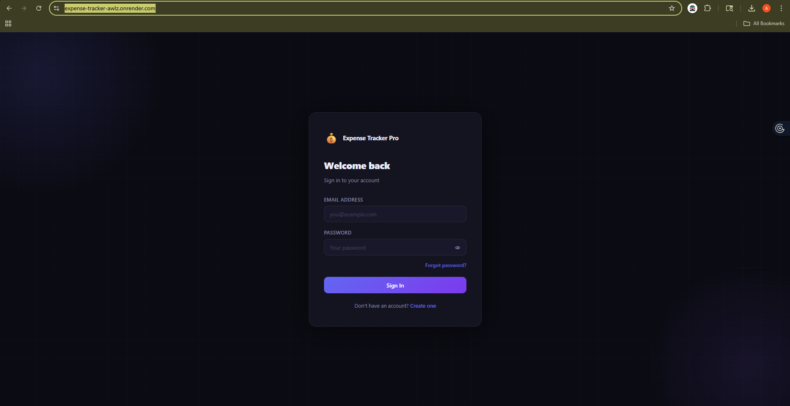
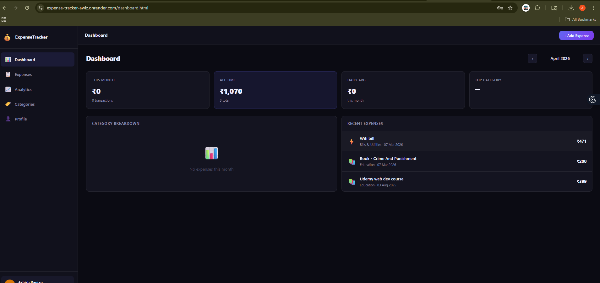

# 💸 Expense Tracker

A modern, full-stack **Expense Tracking Web App** built with a focus on **clean UI, real-world features, and production readiness**.

🔗 **Live App:** https://expense-tracker-awlz.onrender.com/

---

## 🚀 Overview

Expense Tracker Pro helps users manage their daily expenses with a sleek dashboard, category insights, and authentication system.

This project was built as a **full-stack capstone project** with real-world considerations like authentication, email verification, and deployment.

---

## ✨ Features

* 🔐 User Authentication (Login / Register)
* 📧 Email OTP Verification (Multiple providers tested)
* 📊 Interactive Dashboard
* 💰 Expense Tracking
* 📁 Category-wise Breakdown
* 📈 Analytics-ready structure
* 🌙 Modern Dark UI
* 📱 Responsive Design
* ☁️ Deployed on Render

---

## 🖥️ UI Preview

### 🔑 Authentication Page

Clean and minimal login experience with OTP support.

<p align="center">
  
</p>

---

### 📊 Dashboard

Modern dashboard with insights, recent expenses, and category breakdown.

<p align="center">
  
</p>

---

## 🛠️ Tech Stack

### Frontend

* HTML
* CSS (Custom styling, no heavy frameworks)
* JavaScript (Vanilla)

### Backend

* Node.js
* Express.js

### Database

* MySQL

### Email Services (Experimented)

* Nodemailer (Gmail SMTP - for local testing)
* Resend (Faced free-tier limitations)
* SendGrid (Working but sometimes delayed / spam issues)

### Deployment

* Render

---

## ⚙️ Key Engineering Decisions

### 📧 Email Delivery Challenges

Email verification was implemented with real-world constraints:

* **Nodemailer (Gmail SMTP)**
  ✔️ Works well locally
  ❌ Not reliable for production

* **Resend**
  ❌ Free tier limitations affected OTP delivery

* **SendGrid**
  ✔️ Works but
  ⚠️ Occasional delays
  ⚠️ Emails may land in spam

👉 **Future Improvement:**
Will integrate a **custom domain + verified sender identity** to ensure:

* Better deliverability
* No spam issues
* Faster OTP delivery

---

## 📂 Project Structure

```
Expense_Tracker/
│
├── assets/                 # Static images / resources (deleted/optional)
│
├── database/               # Database-related files (SQL, configs, etc.)
│
├── middleware/             # Express middlewares (auth, error handling, etc.)
│
├── public/                 # Frontend static files (HTML, CSS, JS)
│
├── routes/                 # API route definitions
│
├── scripts/                # Utility or setup scripts
│
├── utils/                  # Helper functions (email, OTP, etc.)
│
├── .dockerignore           # Docker ignore file
├── .gitignore              # Git ignore file
│
├── Dockerfile              # Production Docker config
├── Dockerfile.dev          # Development Docker config
│
├── docker-compose.yml      # Docker compose (production)
├── docker-compose.dev.yml  # Docker compose (development)
│
├── package.json            # Project dependencies & scripts
├── package-lock.json       # Dependency lock file
│
├── server.js               # Main entry point (Express app)
│
└── README.md               # Project documentation
```

---

## 🚀 Getting Started

### 1️⃣ Clone the Repository

```bash
git clone https://github.com/ashish6123/Expense_Tracker.git
cd Expense_Tracker
```

### 2️⃣ Install Dependencies

```bash
npm install
```

### 3️⃣ Setup Environment Variables

Create a `.env` file:

```
PORT=5000
DB_HOST=your_host
DB_USER=your_user
DB_PASSWORD=your_password
DB_NAME=your_db

EMAIL_USER=your_email
EMAIL_PASS=your_password
```

### 4️⃣ Run the Server

```bash
npm start
```

---

## 🧠 What I Learned

* Building a **complete full-stack app from scratch**
* Handling **authentication + OTP flows**
* Debugging **real-world email delivery issues**
* Designing a **clean UI without heavy frameworks**
* Deploying and managing a live production app

---

## 🔮 Future Improvements

* ✅ Domain-based email authentication (SPF, DKIM)
* 📊 Advanced analytics (charts & trends)
* 🔔 Notifications & reminders
* 📱 Progressive Web App (PWA)
* 🔐 JWT + refresh token system
* 💳 Budgeting & savings goals

---

## 🤝 Contributing

Contributions are welcome! Feel free to fork the repo and submit a PR.

---

## ⭐ Support

If you like this project:

* ⭐ Star the repo
* 🍴 Fork it
* 📢 Share it

---

## 👨‍💻 Author

**Ashish Ranjan**


---

## 💬 Final Note

This project reflects **real-world problem solving**, not just coding — especially handling **email delivery challenges in production environments**.

More improvements are coming 🚀
